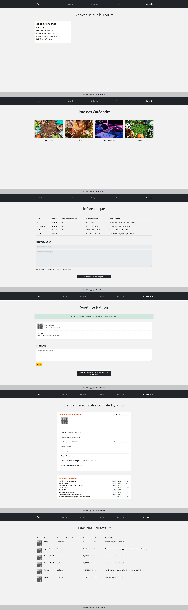

# Backend Project - Forum app 

## Welcome! 👋

Thanks for checking out this back-end personal project.

## The Project

It's a forum app made with a custom framework based on Symfony framework, with a MySQL database made with phpMyAdmin in a MVC architecture.

The functionalities are :
- Creating a new topic inside a certain category with a title and a first message
- Any user can add an answer to a topic
- As admin you can delete a topic and you can see the users list 
- User connexion/registration with personal profil
- Modifying password and personnal informations in the profil page and watching your last posted messages

Stacks used :
- PHP POO
- CSS
- HTML

Css extension :
- Sass

Framework :
- Bootstrap
 
**Don't hesitate to contact me for further informations or to check the code to see more about this app!** 🚀
